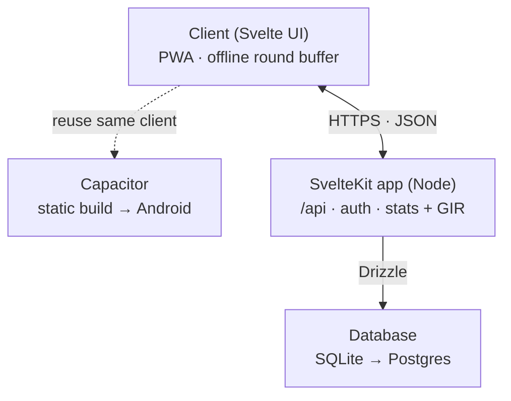

# Architecture

## Overview

A golf round-tracking app in the spirit of The Grint, 18Birdies, and Arccos, built as a portfolio project. The goal for v1 is a small, complete, well-executed app rather than a broad, half-finished one — scope discipline is a deliberate part of the design.

The core idea: capture a small set of honest facts per hole through a fast end-of-hole workflow, then *derive* everything interesting (stats, greens in regulation, and later a handicap estimate) from that raw data. The client stays a lightweight capture-and-display surface; the interesting logic lives on the server.

## v1 scope

In scope:

- **Course setup** — user-entered courses (name, per-hole par, optional yardage), saved and reusable across rounds. No external course database.
- **Round lifecycle** — start a round on a saved course, 9 or 18 holes, track in-progress vs. complete.
- **End-of-hole scoring workflow** — a fast, branching question flow (see below).
- **Round history** — list of completed rounds, each openable to its scorecard.
- **Stats dashboard** — scoring average, putts per round, fairways in regulation %, greens in regulation %, and scoring average by par-3 / par-4 / par-5.

Out of scope for v1 (candidate enhancements):

- Handicap calculation (the full World Handicap System is intentionally deferred).
- GPS rangefinder / course maps and shot-by-shot tracking (the Arccos-style features). The architecture leaves room for these without a rewrite.
- Multi-user social features.

## Tech stack

| Layer | Choice | Rationale |
|---|---|---|
| Frontend + backend | SvelteKit (Svelte 5, TypeScript) | One coherent full-stack codebase; server endpoints, form actions, and deploy in one project. |
| Data access | Drizzle ORM | Lightweight, type-safe; maps cleanly onto the relational model. |
| Database | SQLite (dev) then Postgres (prod) | Zero-setup locally; production-grade in deployment; adapter-swappable. |
| Auth | Session-based (Lucia-style) | Demonstrates auth without over-scoping v1. |
| Delivery (v1) | PWA (installable, offline-capable) | A shareable live URL — one tap for a reviewer, no install friction. |
| Delivery (later) | Capacitor (native Android/iOS shell) | Same client, wrapped; unlocks native GPS for future rangefinder work. |
| Deploy | SvelteKit adapter-node | Adapter system allows retargeting Vercel / Node / Cloudflare via config. |

## Delivery model

v1 ships as a PWA served by the SvelteKit Node build, which both renders the app and hosts the API. To keep the door open to a native app, **all data access goes through `/api` route handlers** rather than only through form actions and load functions. That one discipline means the same client source can later be built static and wrapped with Capacitor, calling the same hosted API over HTTPS. The only additional concern at that point is CORS, handled in `hooks.server.ts`.

## System diagram



Three stacked layers: the Svelte client (a PWA that buffers the in-progress round locally) talks over HTTPS/JSON to a single SvelteKit Node app that owns the API, auth, and stats logic, which reaches the database through Drizzle. The dashed offshoot is the future Capacitor build, which reuses the exact same client.

## Data model

Five tables. Only raw captured facts are stored; anything derivable is computed on read.

- **users** — `id`, `email`, `display_name`, `created_at`. Present from day one so multi-user isn't a painful retrofit later.
- **courses** — `id`, `name`, `hole_count`, `created_at`.
- **holes** — `id`, `course_id` (FK), `number`, `par`, `yardage`. A separate table so courses are reusable without duplicating par data.
- **rounds** — `id`, `user_id` (FK), `course_id` (FK), `tee`, `played_on`, `hole_count`, `status`. `hole_count` (9 or 18) lives on the round, not just the course, so a 9-hole round can be played on an 18-hole course.
- **scoring** — `id`, `round_id` (FK), `hole_number`, `strokes`, `putts`, `fairway_hit`, `penalties`, `penalty_type`.

`scoring` field notes:

- `fairway_hit` — enum: `hit`, `left`, `right`, `long`, `short`, `na`. `na` on par 3s (no fairway to hit); a miss records its direction.
- `penalties` — integer count of penalty strokes taken on the hole.
- `penalty_type` — nullable enum: `out_of_bounds`, `water_hazard`, `lost_ball`, `unplayable`. Null when there is no penalty. Captured so penalties can eventually be scored *correctly* (each type carries a different stroke rule).

Derived, never stored:

- **Greens in regulation** — `(strokes - putts) <= (par - 2)`.
- **Fairways in regulation %**, **putts per round**, **scoring averages** — all aggregated in `stats.ts` from the raw scorings.

## Scoring workflow (INSERT IMAGE)

The end-of-hole flow is a single path with two optional spurs, so the golfer's mental model never forks. On a clean par-4/5 it's three questions; the branches only cost extra taps when something actually happened.

Flow:

1. **Par 3?** — a branch the app already knows from the hole's par (not a question). On a par 3, skip the fairway question and open on putts.
2. **Did you hit the fairway?** (par 4/5 only) — yes continues; **no** triggers a *miss-direction* follow-up (`left` / `right` / `long` / `short`).
3. **How many putts?** — always asked.
4. **Any penalties?** — no continues; **yes** triggers a *penalty-type* follow-up.
5. **Final score?** — asked last, so it can be validated against what came before.
6. **Review & save** — summary (including auto-derived GIR), then save and advance.

Input controls follow a consistent design language: binary questions are vertical Yes/No stacks, counts (putts, score) are steppers, direction is a spatial pad, and categories (penalty type) are vertical lists.

**Score validation** — because putts and penalties are captured first, the final score has a hard floor:

```
final score >= putts + penalties + 1
```

The one guaranteed non-putt stroke is the tee shot. The stepper defaults to par (or the floor, if the floor exceeds par) and won't drop below the floor. This also protects the GIR derivation, which produces nonsense if score is ever below putts.

The workflow branching and this validation live in `src/lib/scoring/workflow.ts`, imported by both the client (to drive the UI) and the server (to enforce integrity on submit) — written once, enforced in both places.

## Project structure

```
golf-app/
├─ src/
│  ├─ lib/
│  │  ├─ server/                  # server-only — never shipped to the client
│  │  │  ├─ db/
│  │  │  │  ├─ schema.ts          # Drizzle: users, courses, holes, rounds, scoring
│  │  │  │  ├─ index.ts           # db client
│  │  │  │  └─ queries.ts         # typed data access (getRound, saveScoring, …)
│  │  │  ├─ auth.ts               # session validation
│  │  │  └─ stats.ts              # aggregation + GIR derivation
│  │  ├─ scoring/
│  │  │  └─ workflow.ts           # branching flow + score-floor validation (shared)
│  │  ├─ types.ts                 # shared TS types (Round, Scoring, HoleResult…)
│  │  └─ components/              # QuestionCard, Stepper, DirectionPad, ReviewCard…
│  ├─ routes/
│  │  ├─ +layout.svelte
│  │  ├─ +page.svelte             # home / dashboard
│  │  ├─ courses/…                # course setup screens
│  │  ├─ rounds/
│  │  │  ├─ +page.svelte          # round history
│  │  │  ├─ new/+page.svelte      # start a round
│  │  │  └─ [id]/+page.svelte     # scorecard + per-hole scoring flow
│  │  ├─ stats/+page.svelte       # stats dashboard
│  │  └─ api/                     # the Capacitor-safe seam — all data access here
│  │     ├─ courses/+server.ts
│  │     ├─ rounds/+server.ts
│  │     ├─ rounds/[id]/+server.ts
│  │     ├─ rounds/[id]/scores/+server.ts
│  │     └─ stats/+server.ts
│  ├─ hooks.server.ts             # session auth + CORS (for the Capacitor origin later)
│  └─ service-worker.ts           # offline caching
├─ static/manifest.webmanifest    # PWA install
├─ scripts/                       # seed + db-check scripts (npm run db:seed / db:check)
├─ drizzle.config.ts
├─ vite.config.ts                 # SvelteKit config lives here (new template style); adapter-node now, adapter-static later
└─ package.json
```

Two placement decisions carry most of the weight. Everything under `lib/server/` is server-only, so Drizzle, auth, and stats never reach the client bundle — a security boundary that also keeps the client light enough to wrap in Capacitor. And `scoring/workflow.ts` sits outside `server/` on purpose, because both client and server import it.

## API surface

| Method + path | Purpose |
|---|---|
| `POST /api/courses` and `GET /api/courses` | Create a reusable course; list saved courses |
| `POST /api/rounds` | Start a round (course, tees, hole count) → returns round id |
| `GET /api/rounds` | Round history for the dashboard |
| `GET /api/rounds/[id]` | One round with its scorings, for the scorecard |
| `POST /api/rounds/[id]/scores` | Submit a hole — server validates the floor, derives GIR, stores raw facts |
| `PATCH /api/rounds/[id]` | Mark the round complete |
| `GET /api/stats` | Aggregated stats |

There is deliberately no `/gir` endpoint and no stored fairway percentage — those are computed in `stats.ts` from the raw scorings, the same derive-don't-store discipline carried up from the data model into the API.

## Offline strategy

Golfers routinely lose signal mid-course, so the app must record holes without a live connection. v1 uses a pragmatic middle ground rather than full offline sync: the client buffers the in-progress round locally (IndexedDB, via the service worker) and submits scorings as connectivity allows, with the round safely recoverable if the app is backgrounded or closed. Full multi-device offline sync is a candidate enhancement, not a v1 requirement.

## Future enhancements

- Simplified, clearly-labeled handicap estimate, then full World Handicap System.
- Capacitor packaging for a native Android (then iOS) app.
- GPS rangefinder and course maps (native geolocation via Capacitor).
- Penalty-type-aware stroke assistance (use `penalty_type` to suggest the correct penalty strokes).
- Shot-by-shot tracking (Arccos-style).
