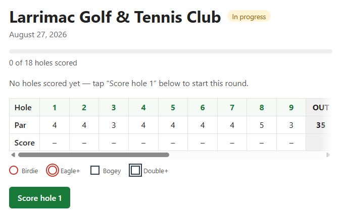

# Fairway

A simple, fast golf round tracker: log each hole through a streamlined end-of-hole workflow, then see your stats. Built in the spirit of The Grint, 18Birdies, and Arccos — deliberately scoped small.

> Portfolio project, full-stack SvelteKit. Built to be a clean, complete v1 rather than a broad, half-finished one.

## Demo

## Demo

**Live:** https://fairway-vert-pi.vercel.app/

| Rounds | Scorecard | Stats |
| :---: | :---: | :---: |
|  |  |  |

## Features (v1)

- Create reusable courses (name, per-hole par, yardage)
- Start and track 9 or 18-hole rounds
- Fast, branching end-of-hole scoring — fairway, putts, score — surfacing only the follow-ups that matter (miss direction)
- Automatic derivations (greens in regulation, fairways hit, and more) computed from raw data, never manually entered
- Round history and per-round scorecards
- Stats dashboard: scoring average, putts/round, fairways hit %, GIR%, and scoring by par type
- Installable PWA that keeps working when you lose signal mid-course

## Tech stack

- **SvelteKit** (Svelte 5, TypeScript) — full-stack: UI, API, and server logic in one codebase
- **Drizzle ORM** over **libSQL** — a local SQLite file in dev, **Turso** (hosted libSQL) in prod
- **Session-based auth** (scrypt password hashing, SHA-256 session tokens)
- **PWA** (offline-capable), architected so the same client can later be wrapped with **Capacitor** for native Android/iOS
- **Deployed on Vercel** via `@sveltejs/adapter-vercel` (Node runtime)

## Local setup

Requires Node 22+ (see `.nvmrc`).

```bash
npm install
cp .env.example .env      # DATABASE_URL defaults to file:local.db (a local libSQL file)
npm run db:migrate        # create the schema
npm run db:seed           # optional: a dev user + sample course
npm run dev               # http://localhost:5173
```

Dev login (from the seed): `dev@fairway.local` / `password123`.

Handy scripts: `npm test` (unit), `npm run check` (types), `npm run lint`. The PWA/service
worker only runs in a production build, which happens on Vercel (the Vercel adapter's build
uses symlinks that Windows blocks without Developer Mode) — test the installable PWA on the
deployed URL, or build on WSL/macOS/Linux.

## Architecture

See [ARCHITECTURE.md](./ARCHITECTURE.md) for the full design — data model, scoring workflow, API surface, and offline strategy. In short: the app captures a few honest facts per hole and derives everything interesting on the server.
